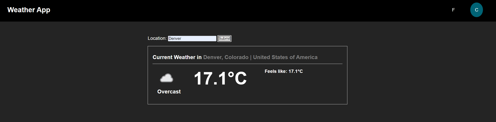

# Weather App

Web application that reports the weather for a given city using WeatherAPI.

Live Demo: https://ahmed-mgd.github.io/weather-app/



## Installation and Usage

1. Clone the repository and navigate to the directory. Run:

```bash
npm install
```

2. To run in a development environment:

```bash
npm run dev
```

## Topics

- Asynchronous functions (Fetch)
- API's

## Lessons Learned

- An async function will always return a promise, so the final response must follow an async structure as well.
- Learned how to work with fetch() to make calls to servers and process the received data.

## Future Implementations

NOTE: the current version has minimal functionality and was intended for learning the basics of async functions.

- Add more details to current weather
- Forecast for next 3 days
- Clean up interface
